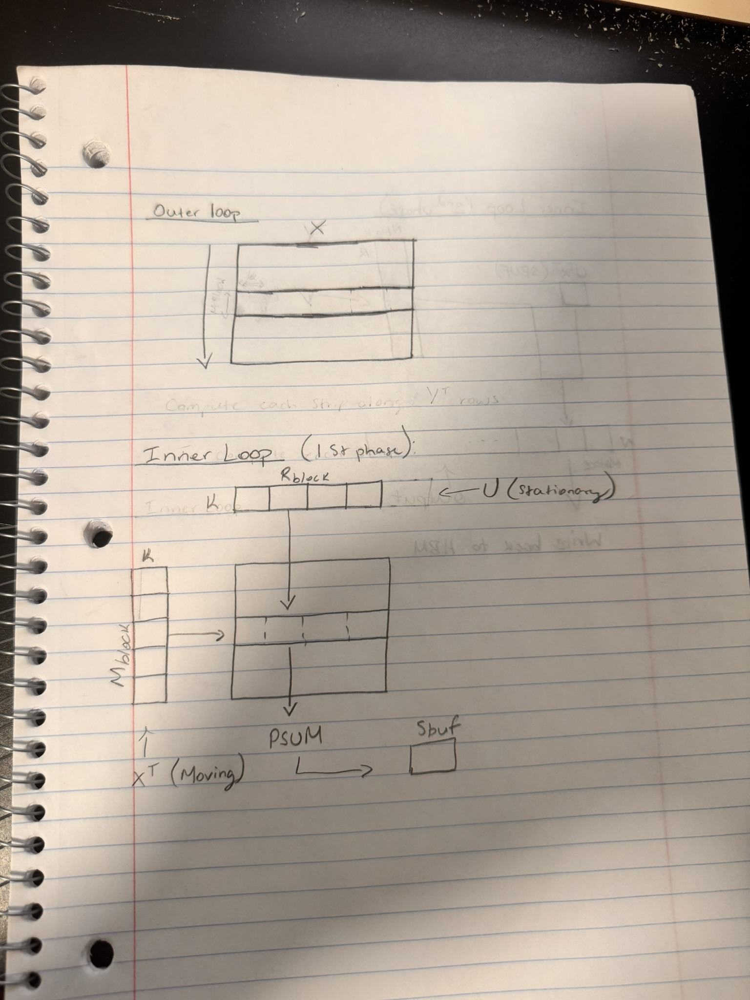
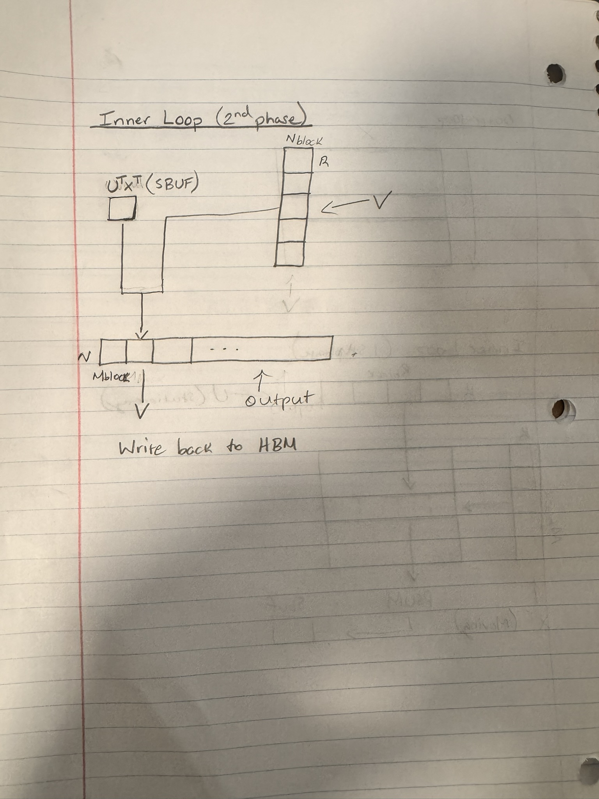

# XUV NKI Kernel

This kernel takes the output of the SVD, where W = UV, such that the weight matrix is compressed
into two smaller U and V matrices. (Didn't quite catch what the did with the sigma diagonal matrix that is output
by SVD).

## Caching

The Kernel calcualtes an entire row of the intermediate matrix and then caches thatinto the SBUF. 
This cached row then is multiplied with all the corresponding column strips of the V matrix.
The shape of the cached row is (𝐵𝑀, 𝑟), where 𝐵𝑀 = 𝑡𝑀 × 𝑇𝑀. 𝑇𝑀 is the tile size that is supported by Trainium
and 𝑡𝑀 is the number of tiles of in the M dimension.

## Implicit Transposition

The systolic array architecture requires that the left matrix (stationary) of NKIMatmul needs to be transposed
so that the columns of the right matrix (moving) line up with the rows of the left matrix.
Since we are using two smaller matrices UV in place of our W matrix and performing two NKIMatmuls, we would need
to transpose the intermediate matrix Y = XU before performing the second NKIMatmul. To avoid this explicit transpose
operation, the matrix identity (XU)^T = U^TX^T. This is the same as passing in U as the left matrix (stationary)
while passing in X^T as the right matrix (moving) to the NKIMatmul function.

## Full Algorithm

